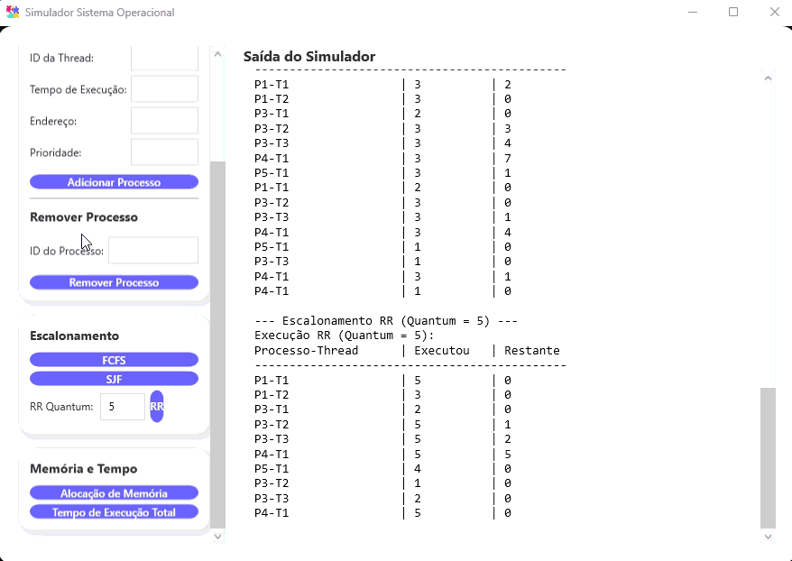
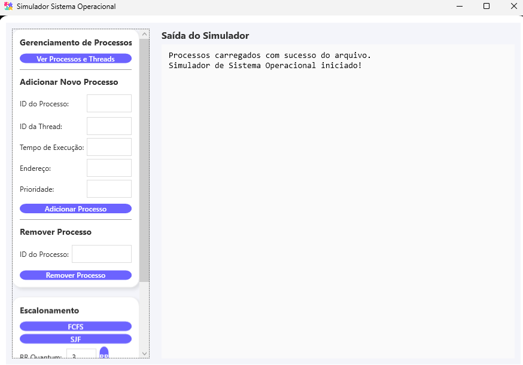
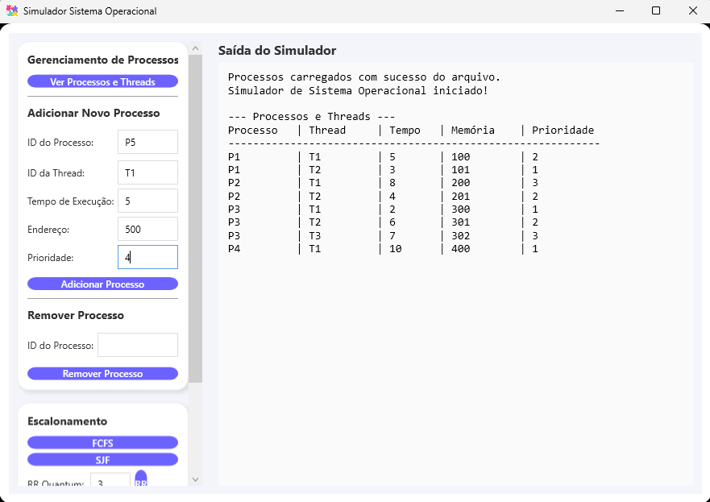
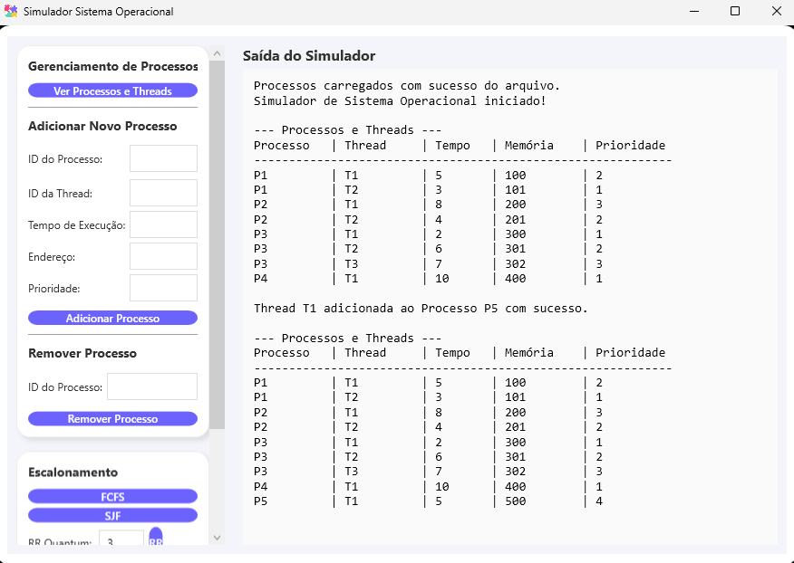
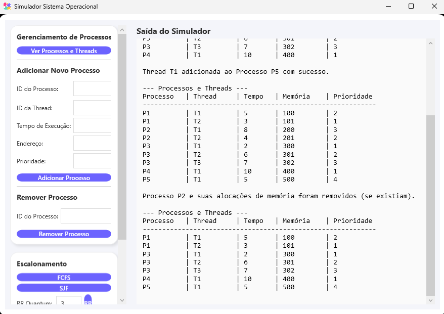
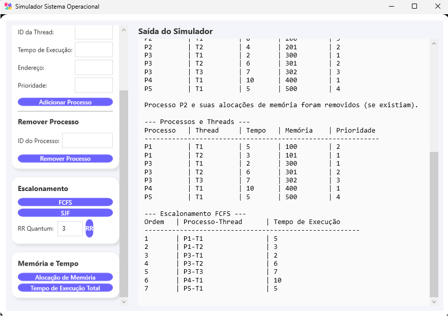
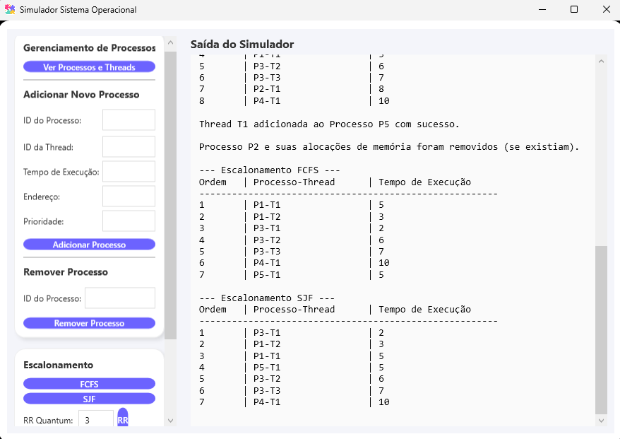
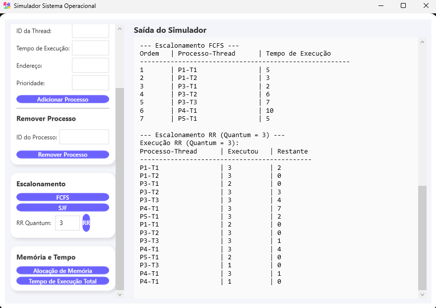
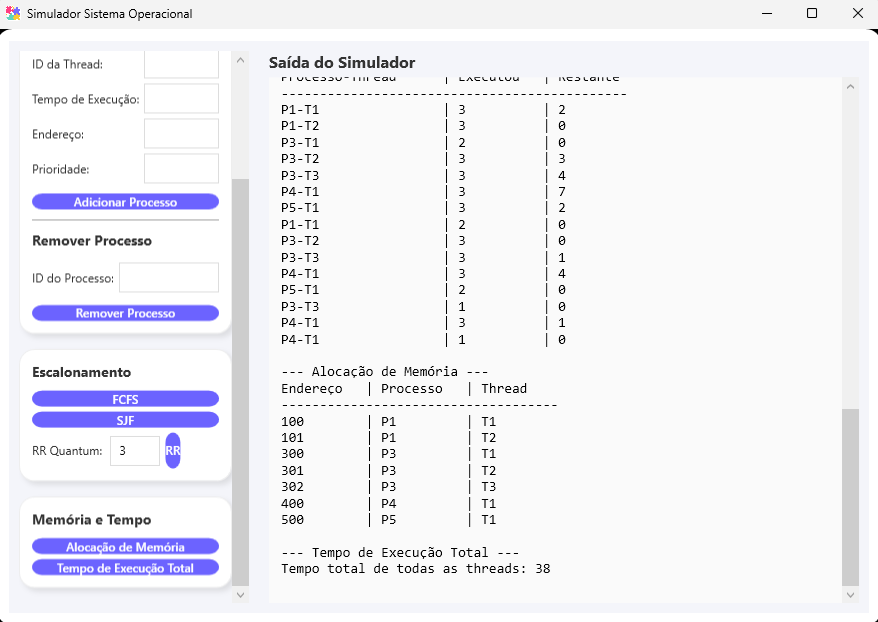

# Simulador de Processos (SimuladorSO)

Este projeto é um **simulador de gerenciamento de processos** desenvolvido em C# com WPF, que permite visualizar o comportamento de processos e threads utilizando três tipos de escalonamento: **FCFS, SJF e Round Robin**.  

⚠️ **Importante:** Este simulador **não envolve entrada ou saída real de dados** (I/O) e serve apenas para fins educativos, simulando a execução dos processos e a alocação de memória.

---

## Estrutura do projeto

O projeto está organizado em três módulos principais:

- **SimuladorInterface (WPF):**  
  Interface gráfica que permite interação com o usuário por meio de botões, menus e formulários.  

- **SimuladorLogica (Class Library):**  
  Contém toda a lógica de negócio do sistema, como modelos de processos, algoritmos de escalonamento e gerenciamento de memória.  

- **SimuladorSO (Solução):**  
  Projeto principal que organiza os dois módulos acima e integra a interface com a lógica.

---

## Funcionalidades

O simulador permite:

1. **Visualizar processos e threads:**  
   Carregar e exibir processos a partir de arquivos de texto simulados.

2. **Adicionar e remover processos:**  
   Inserir novos processos com ID, thread, tempo de execução, endereço de memória e prioridade, ou remover processos existentes.

3. **Executar escalonadores:**  
   Simular a execução de processos utilizando:
   - **FCFS (First Come, First Served)**
   - **SJF (Shortest Job First)**
   - **Round Robin (RR) com Quantum configurável**

4. **Visualizar alocação de memória e tempo de execução total:**  
   Mostrar como os processos foram alocados na memória e o tempo total de execução simulado.

---
## Demonstração em GIFs 🎥

### ▶️ Adicionando um processo


### ▶️ Removendo um processo


### ▶️ Execução dos algoritmos de escalonamento


### ▶️ Memória e tempo de execução finais


---

## Legendas das imagens

### 1️⃣ Interface visual do simulador ao compilar


### 2️⃣ Visualizando os processos e threads que estão no arquivo de texto


### 3️⃣ Inserindo um novo processo


### 4️⃣ Removendo um processo e atualizando a lista


### 5️⃣ Execução do escalonador FCFS


### 6️⃣ Execução do escalonador SJF


### 7️⃣ Execução do escalonador RR com Quantum = 3


### 8️⃣ Tempo e alocação finais


---

## Observações

- Este simulador é **educacional** e serve para demonstrar conceitos de escalonamento de processos e gerenciamento de memória de forma **visual e interativa**.  
- Não há processamento real de I/O ou execução de programas; todos os cálculos e atualizações são simulados internamente.  
- A interface WPF permite testar diferentes cenários, visualizar saídas e interagir com os processos de maneira prática.

---

## Como executar
1. Clone este repositório:

```bash
git clone https://github.com/CarolineGrizante/SistemaOperacional.git
---
